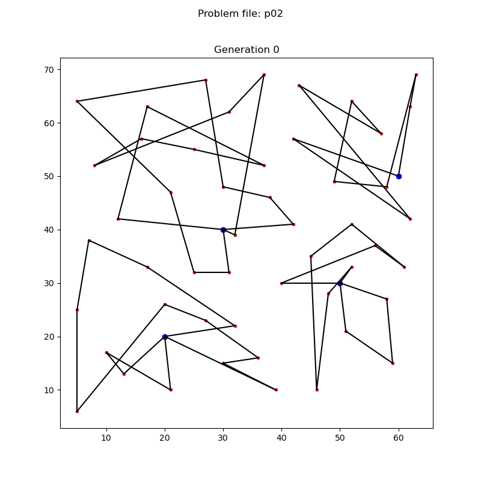

# Project 2 - Solving Multi-Depot Vehicle Routing Problems with Genetic Algorithms

## Getting started

### Running a specific problem

Add the input file to the `./test_data` folder and change the `input_file: my_input_file` in `config.yaml`. Then run it with the `-r` flag.

### Running all test files

Simply run with the `-t` flag.

#### How to run in VS Code

Open the `./mdvrp` folder as a workspace and run the `App.java` file. Note that it must be run from this workspace for relative paths to work.

### Visualizers

- `vizualiser.py` displays the best solution found by the genetic algorithm. It must be run after `App.java`.
- `gif_maker.py` creates the Gif you see below.

